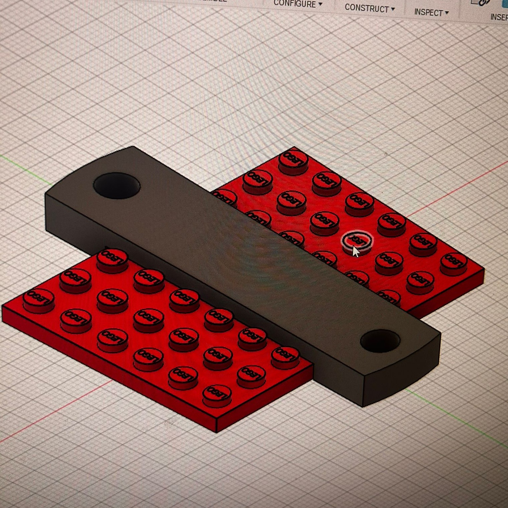
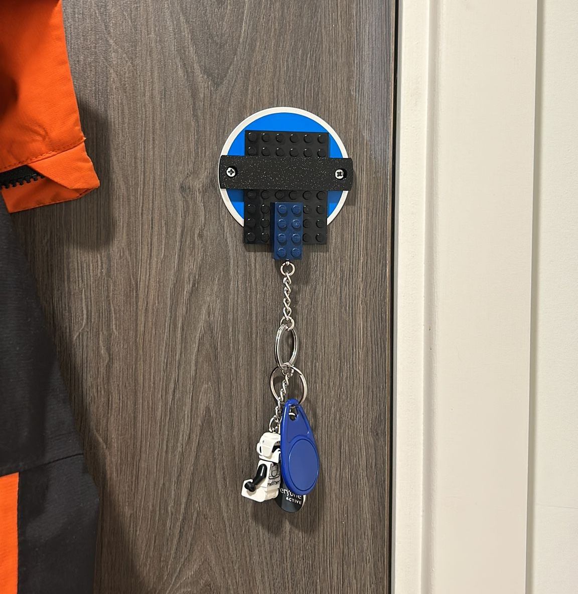

# Lego Key Ring Holder

Although this is a small project, I thought it would be a quick fun one to make. I have a few keys that I use on a daily basis and I thought it would be useful to have a hanger for them. As I live in student accommadation, I don't have many options for wall hooks so I thought this would be a good alternative.

{:width="400px"}

By using the fire safety plate thats screwed to the door, I was able to design a holder for a 8x6 lego plate, along with a lego brick key chain that can be hung from the plate. This way I could have a semi tempory solution to the problem of losing my keys. As I have done things like this before, It only took me about an hour to design and print the part, managing to get the print perfect on the first try.

{:width="400px"}

