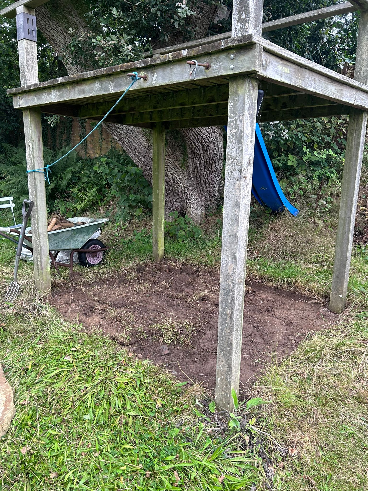
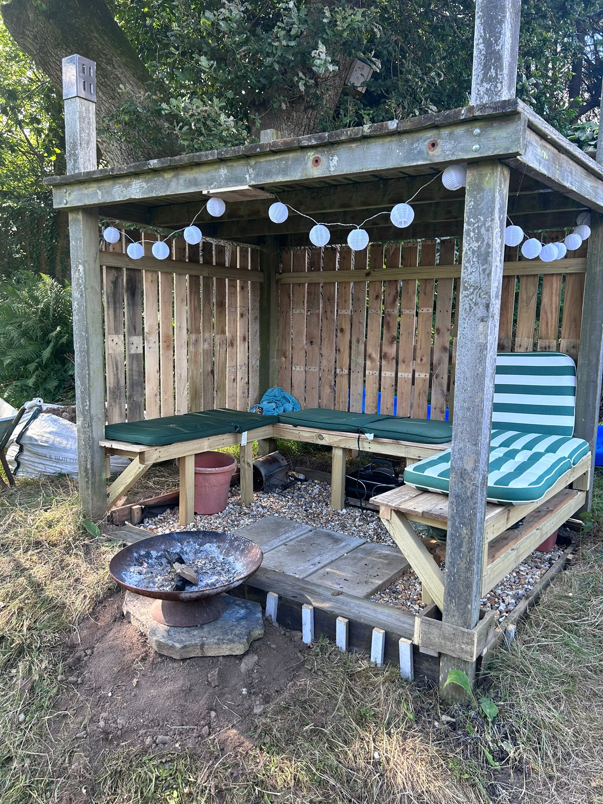

# Outside Canopy

This project was something I took on during the summer of 2023. After graduating from university, I wanted to take a break from the technical work I had been immersed in and revisit one of my more creative hobbies. In our back garden, we’ve had an old, rundown treehouse that’s been there for as long as I can remember, and I thought it would be a fun challenge to give it a bit of a makeover.

{:width="400px"}

I began by clearing out the space and leveling the ground underneath the treehouse. To create a solid foundation, I built an initial frame using 4x2s, which provided a sturdy structure to support the rest of the canopy. This was the only part of the project where I spent money. I’m a big believer in recycling old wood to save money and reduce waste, as perfectly good wood is often thrown away. Luckily, there was a construction site down the road, and I was able to collect some old pallet wood that was being discarded due to minor damage.

After bringing the pallets home, I spent time removing all the nails and repurposing the wood for the canopy’s cladding and seating. Finally, I used leftover stones from a previous project to create a nice base, tying the whole area together.

{:width="400px"}

Above is the finished project, and I’m really happy with how it turned out. Since building it, we’ve hosted a few BBQs with friends, and it has become a fantastic addition to the garden. However, it’s definitely more suited for summer use. In the future, I may look into modifying the space to make it more winter-friendly by adding an outdoor heater.

