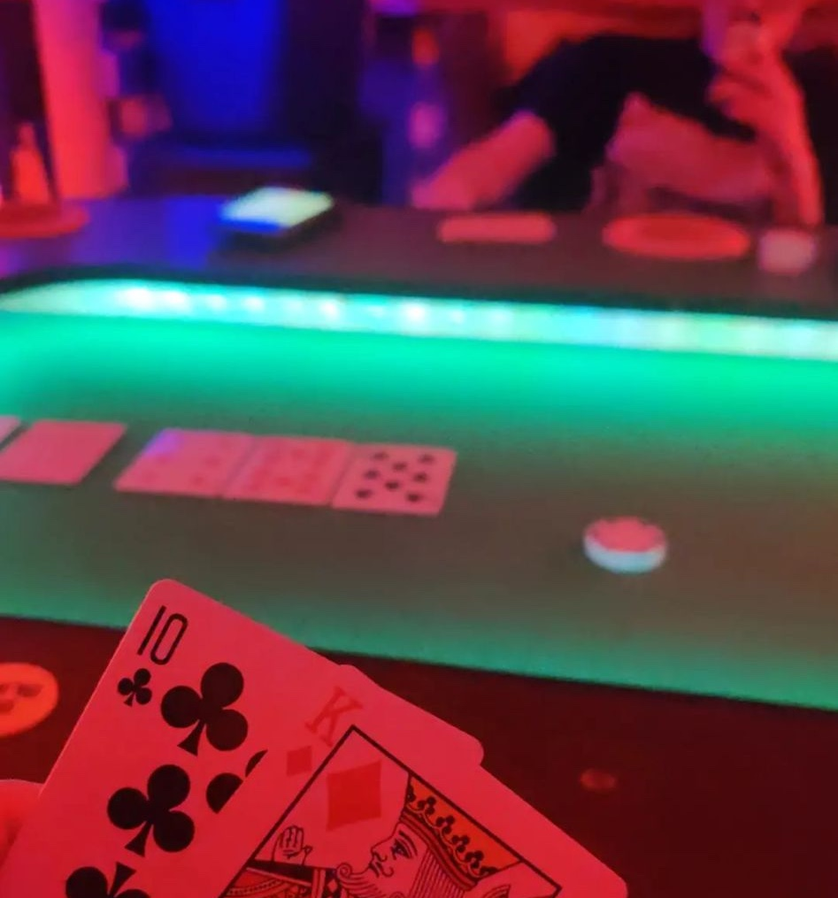

# The Poket Table

During the winter of 2022, I decided it would be nice to play some poker with my friends. However, we had no poker table and I had no space to build one. So, I decided to build a poker table that could be stored in my friends garage. The main feautre wanted for this was it was it couldn't be too big so that it could be stored at any point. For this we used my friends coffee table which was already in the garage, and I created this poker table by letting it sit on top of it.

{:width="400px"}

The table was made from fully recycled materials, using an old pool table for the felt, an old wardrobe for the table top, and then 3D printing some cup holders for drinks. The project took around 5 days to complete and was a great addition to the garage, since we have played multiple times and its a great social space.

{:width="400px"}