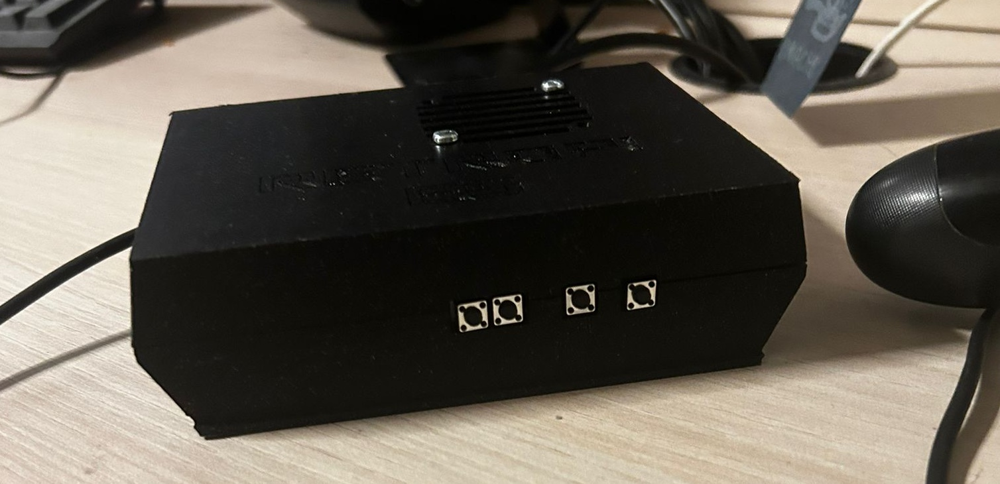
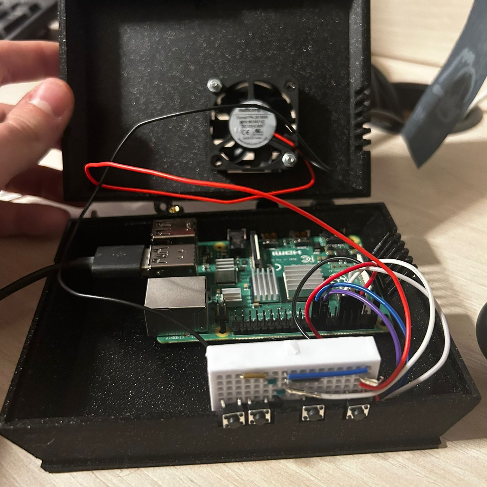

# Raspberry Pi Retro Console

Since starting my degree, I quickly realized how integral Linux is for working with ROS. To improve my Linux skills and gain hands-on experience, I decided to create a retro gaming console using a Raspberry Pi. This project allowed me to dive deeper into Linux while also having fun with a creative build.

{:width="400px"}

Above is the external case I designed for the Raspberry Pi. It features a cooling fan to prevent overheating, a USB slot for the controller, and four buttons connected to the GPIO pins. These buttons control volume (up and down), power the Pi ON/OFF, and reset the game. The project was inspired by a GitHub repository, which can be found [here](https://github.com/RetroPie/RetroPie-Setup). While the repository provided a solid starting point, I wrote additional code to implement the volume control and the power/reset button functionality.

The system runs on a modified version of the RetroPie OS, which is based on Raspberry Pi OS and optimized for retro gaming. I added a few classic games, including Pokémon Red and Pokémon Emerald, making it a nostalgic and functional gaming system.

{:width="400px"}

Navigating and configuring the system was done entirely via the keyboard, as RetroPie does not support mouse input. I frequently used the command "sudo nano 'filename'" to manually edit system files and configure the setup.

Overall, the project turned out just as I had envisioned. Now, I can enjoy some of my favorite Pokémon games on a large screen, all while learning more about Linux and its applications in a hands-on way.