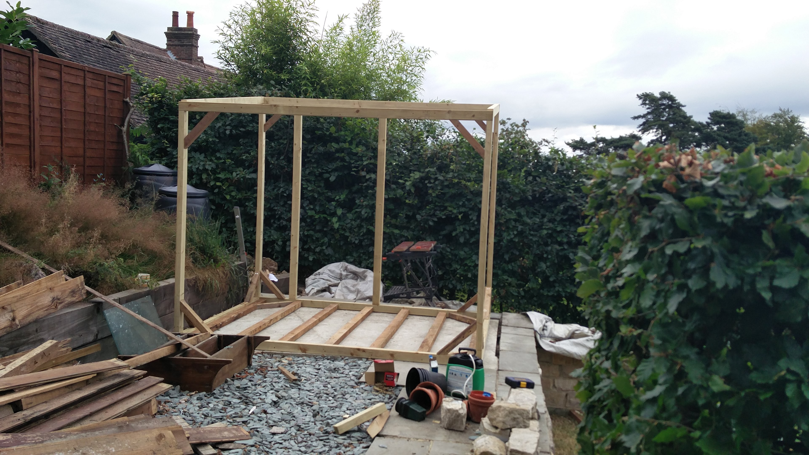
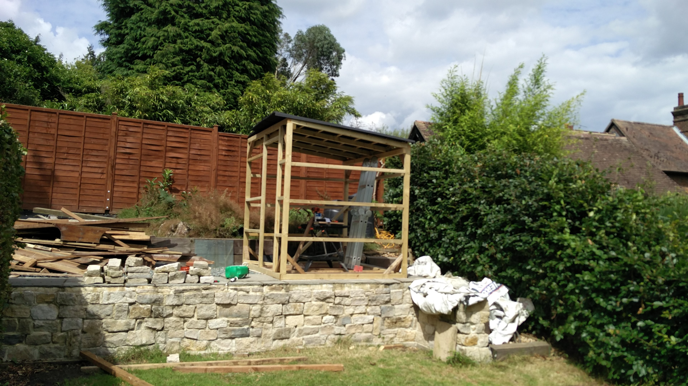
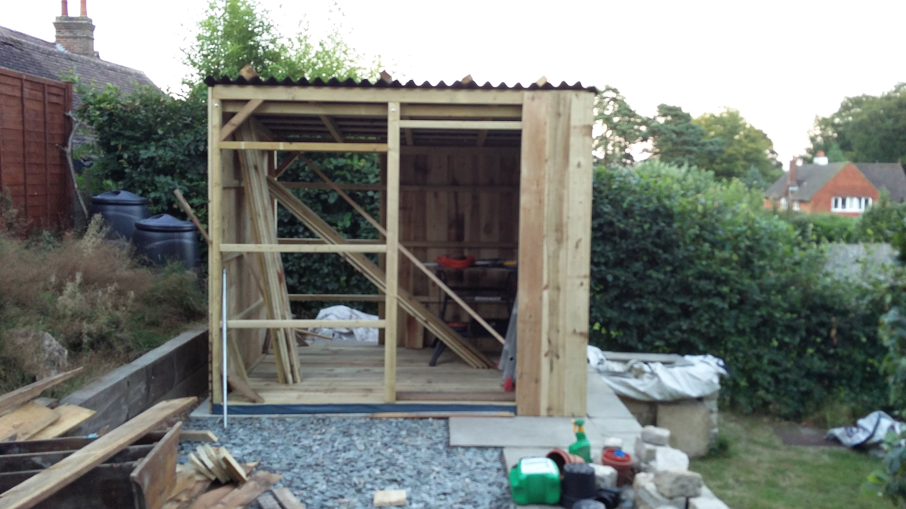
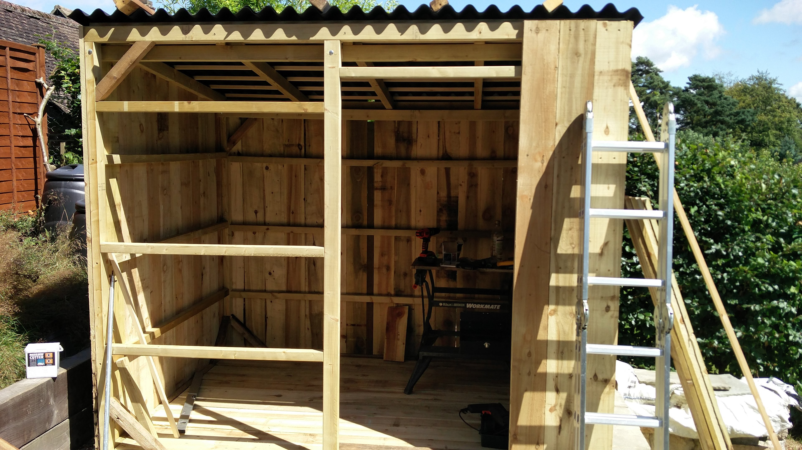
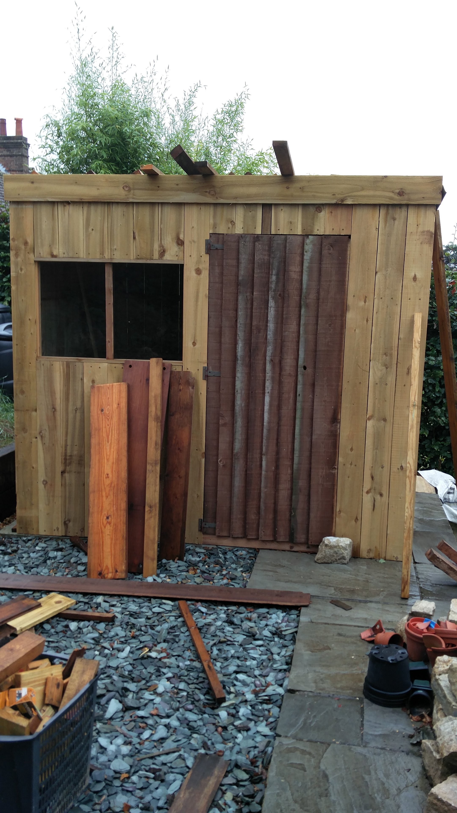
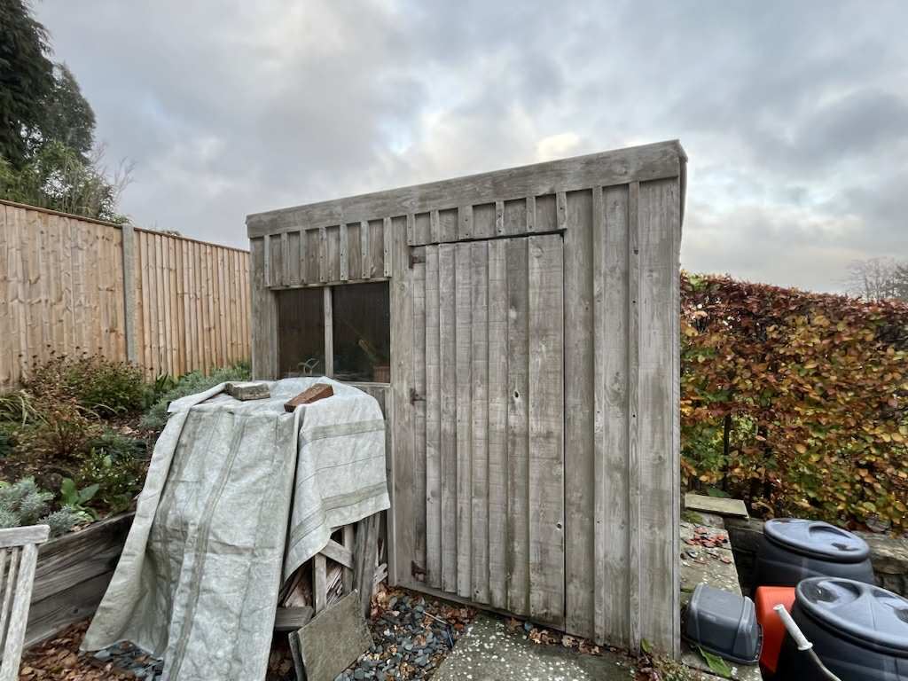

# The Shed Project

**Situation:**  
Picture this: your old shed is over 25 years old, poorly built, riddled with holes in the roof, and a complete hazard to anyone who dares go inside.  

In the summer of 2016, we were left wondering what to do with this broken shell. We decided the best approach was to knock it down and start over — but this time, things would be different.

---

**Planning:**  
The planning stage was mostly my dad figuring out how we could build a new shed. Fortunately, he had thought about this before, and we already had a new location ready toward the back of the garden, where a nice level bed of concrete had been laid in the previous months.  

He recruited me to help, given my experience with woodworking from studying **Design and Technology at school** and working on smaller projects in my free time.  

We ultimately decided against buying a flat-pack shed, as that would likely lead to the same problems we had with the old one, and none of the designs really fit our needs. Instead, we designed a **custom shed from scratch**: a simple structure with a slant toward the back for rain runoff into a water butt, and a single window recycled from the old shed.  

The walls were clad with smaller 0.5×1 pieces over the gaps intentionally, allowing the wood to **expand and contract with seasonal changes**. For the roof, my dad found a corrugated, carbon-fiber-like material — lightweight, insulating, and long-lasting. Aesthetic-wise, the roof was deep black, complementing the shed nicely.  

With a loose plan in place, we were ready to build.

---

**Building:**  
Building was simpler — more my cup of tea. We started by gathering all the 2×3 lengths we needed and cutting most by hand, as this was before we invested in power tools (except for a drill bought for the project).  

We created a **structurally sound frame**, probably overkill, making the shed heavy. This actually worked in our favor, as it isn’t bolted to the ground but simply sits on the concrete base with a ground sheet to prevent moisture ingress.  

  
  

Cladding came next — the most time-consuming part without proper tools, taking up most of the first week. Then we added the roof and inserted the window. By this point, my main work was done helping my dad, who finished the shed with a coat of gray paint that complemented the black roof while preserving the surrounding landscape. The door from the previous shed was salvaged and reused, keeping the project sustainable.  

  
  

---

**Reflection:**  
And there we have it: a freestanding shed built from scratch, taking about a month of hard labour. In hindsight, a few power tools would have made the process much easier, but that’s the point of projects — to **learn from mistakes**.  

{:width="400px"} 

Nine years on, the planning my dad and I put in has clearly paid off, and the shed barely looks any different from the day it was finished. This project wasn’t just about building a shed — it was about **learning, problem-solving, and working together** on something that would last for years.

{:width="600px"} 