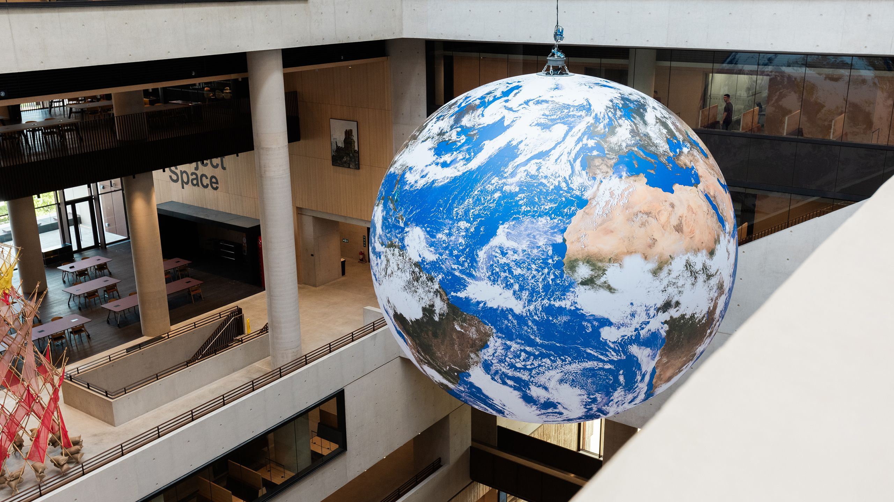
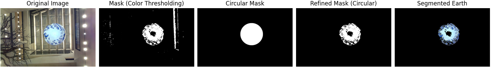
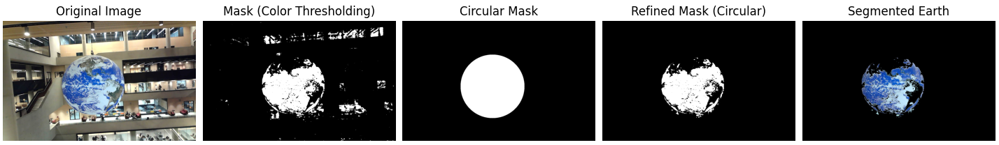
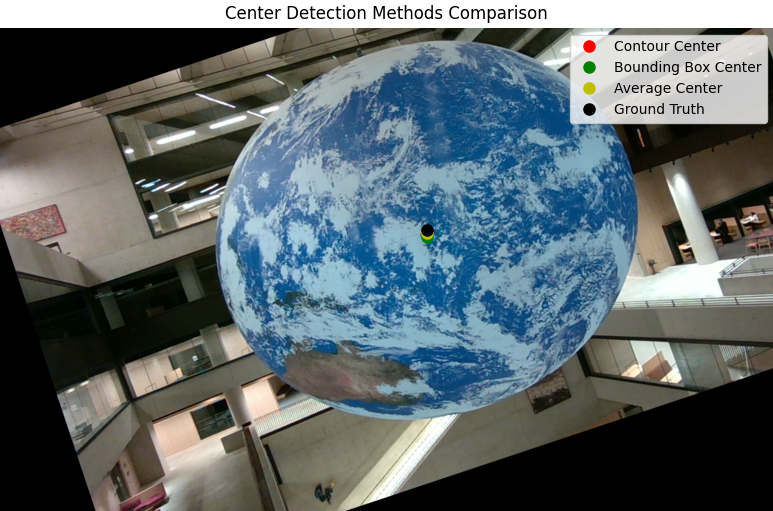

# Computer Vision Modelling — “Gaia”

On the UCL East campus hangs **Gaia**, a large-scale globe approximately **7.6 metres in diameter** suspended in the foyer. Due to air drafts from the main doors, the globe continuously **swings and rotates**. The goal of this project was to **model its dynamics using only a single Pi camera** and computer vision methods — without direct sensors or mechanical measurements.

---

## Task 1 — Object Segmentation

The first challenge was to **segment the globe** (the “AO”, or *Earth-like object*) from the background across varying lighting conditions. Several approaches were tested, including **HSV colour thresholding**, **Hough Circle Transform**, and a **combined contour-based method**.  
The final hybrid technique used HSV thresholding to isolate colour regions, followed by **contour extraction and circle fitting**, which proved both accurate and efficient under changing light and reflections.

---

## Task 2 — Centre Tracking and Swing Dynamics

Next, the focus shifted to **tracking the globe’s centre** to measure its swing pattern. Multiple geometric methods were compared, including bounding boxes, contour means, and **minimum enclosing circles**, with the latter providing the most consistent results.  
Tracking over time revealed that the globe’s motion followed a **rotating elliptical path**, rather than a simple one-dimensional swing — a behaviour confirmed through feature-based analysis using **SIFT**.

---

## Task 3 — Rotation Estimation

To measure the **rotation period**, two approaches were tested:  
1. A **side-view method** that compared frame similarity using feature matching.  
2. A **ground-view method** that computed angular displacement between frames.  

Both techniques produced accurate and comparable results, confirming that the globe’s rotation is **not constant**, but varies due to torque effects in its suspension cable.  
Real-time estimation was attempted, though limited by the computational cost of SIFT.

  
  

---

## Task 4 — Surface Velocity and Scale Calibration

The final task aimed to estimate **surface velocity** using visual tracking and scale calibration.  
By combining **depth data from a RealSense D455** and **geometric projection**, the true globe diameter was established at 7.603 m.  
Feature tracking between consecutive frames produced velocity estimates, revealing that **swing-induced motion dominated surface readings**, highlighting the challenge of isolating rotational effects in dynamic conditions.

---

### 💡 Key Takeaways
- Applied **colour segmentation**, **feature matching**, and **stereo geometry** to model physical motion from video alone.  
- Demonstrated how **computer vision** can extract dynamic behaviour without direct sensors.  
- Identified key limitations in **real-time computation** using SIFT and proposed **ORB** as a faster alternative.  
- Gained practical insight into **motion tracking, camera calibration**, and **error analysis** for vision-based modelling.  

---
