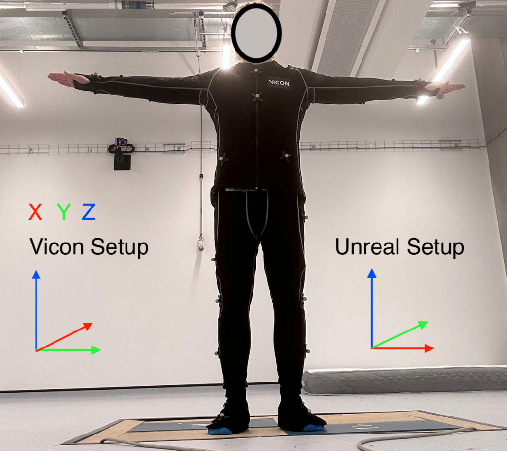

# Microsoft Kinect Balance Game

My Leeds dissertation explored ways to reduce elderly hospital visits caused by falls. While many approaches use **assistive robotics or exoskeletons** to reactively support stability, I wanted to explore a **preventive solution**. Research suggested that training **core stability muscles** significantly lowers fall risk, which inspired the design of a balance-focused game.

Using **Unreal Engine 4** and the **Xbox Kinect**, I developed multiple mini-games aimed at improving balance and core strength. To validate the Kinect’s motion capture capabilities, I compared its tracking against a **Vicon motion capture system**, revealing that the Kinect struggled to accurately capture motion in certain planes. This highlighted the limitations of consumer-grade sensors for precise rehabilitation applications.

{:width="600px"} 

### 💡 Key Takeaways
- Designed interactive balance training exercises in UE4 using Kinect input.  
- Learned to integrate **motion capture data** for validation and analysis.  
- Gained insight into sensor limitations and system design for rehabilitation applications.

---

### 📄 Download the Dissertation

