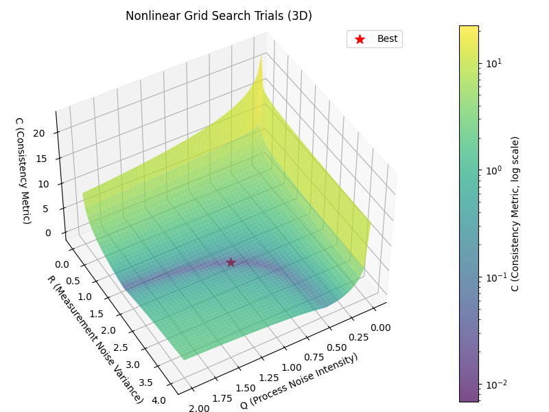

# Automatic Tuning for Factor Graph-Based Estimation Using Bayesian Optimisation

In robotics, state estimation systems such as **Simultaneous Localisation and Mapping (SLAM)** often rely on manually tuned noise parameters — a process that is **time-consuming, subjective, and error-prone**. While previous work has automated tuning for Kalman Filters, this dissertation extended those ideas to the more flexible and complex world of **factor graphs**.

The goal was to create a **proof-of-concept system** that could automatically tune a factor graph’s **process and measurement noise parameters** using **Bayesian Optimisation (BO)**. To measure estimator quality, the project adapted two statistical consistency metrics:  

- **Consistent Normalised Estimation Error Squared (CNEES)** — checks whether the true estimation error matches the predicted uncertainty.  
- **Consistent Normalised Innovation Squared (CNIS)** — tests whether measurement residuals are unbiased and uncorrelated (“white”).  

These metrics formed the backbone of the automatic tuning framework.

---

## ⚙️ How It Worked — The Method

The project was built around a **2D tracking simulation** designed to test and validate the tuning pipeline.

1. **System Design:** Implemented both a **linear (Constant Velocity)** and **non-linear (Constant Turn)** motion model to estimate true process noise \(V\) and measurement noise \(σ²\).  
2. **Exploring the Problem:** Conducted an exhaustive **grid search** across parameter space to visualise the CNIS cost surface. This revealed a *broad, flat diagonal valley* where many parameter combinations produced similar consistency — a key reason manual tuning feels ambiguous.  
3. **Proposed Solution:** Introduced **Bayesian Optimisation** to search the parameter space efficiently. BO used a **Gaussian Process model** to predict promising regions, cutting computation dramatically compared to brute-force search.  
4. **Monte Carlo Stability:** Early experiments with small Monte Carlo samples (\(N = 500\)) led to unstable CNIS results. Stability was achieved only after increasing runs to **\(N = 5000 to 10000\)**, ensuring a smooth cost surface for the optimiser to follow.

---

## 📊 What I Found — Results & The Twist

Bayesian Optimisation worked exactly as intended — it quickly converged to the **optimal region** within the CNIS cost valley. However, the most interesting result came from comparing **statistical consistency** (CNIS) against **tracking accuracy** (Mean Squared Error, MSE):

- There was **almost zero correlation** between CNIS and MSE.  
- The factor-graph estimator proved **highly robust**: both the “true” parameters and the BO-tuned ones produced similarly low tracking errors.  
- Within the cost valley, any “good enough” parameter set gave near-identical performance.

This revealed a fundamental insight — tuning purely for statistical consistency doesn’t necessarily improve real-world performance. Due to the robustness of the Factor Graph, a simple guess of these noise paramters is sufficient, as long as you are close enough.

---

## 🧭 Conclusion & Future Work

The dissertation successfully demonstrated an automated tuning framework for factor-graph-based estimation, validating the use of Bayesian Optimisation to replace manual noise tuning.

Future work could extend this approach to multi-objective optimisation, balancing statistical soundness with practical accuracy, or integrate parallelised optimisation for large-scale SLAM applications.

> I am currently working on Publishing this paper and will attach a Link when I have completed the process. In the meantime check out the GitHub Repo for a better understanding of the project as well as the full length paper below

---





