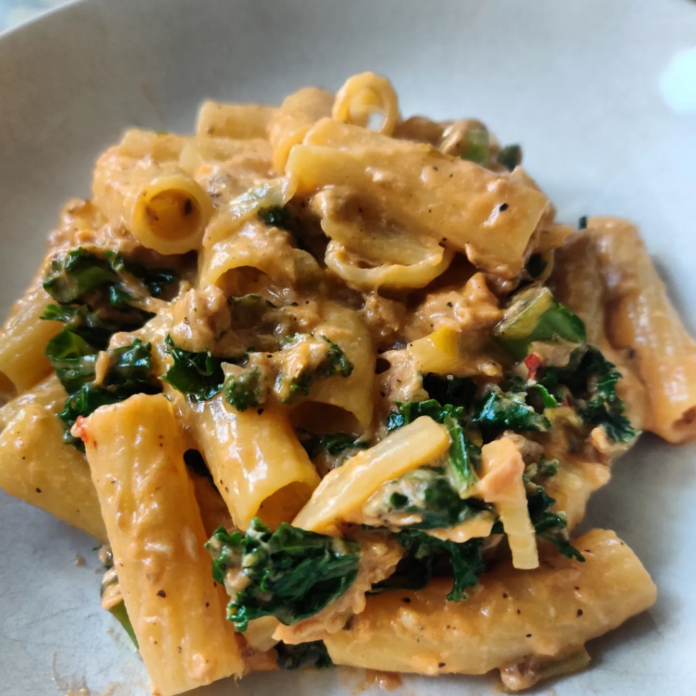

# **About Me**

Hi I am **{{ site.author.name }}** :wave:, 
Here’s a little about me, along with my skills and hobbies! I’m currently a student at UCL, working toward a master’s degree in robotics, and I’m seeking opportunities in this exciting field starting September 2025, once I’ve completed my studies.

In my free time, I enjoy exploring creative projects like the ones showcased in the "Projects" tab. Outside of tech, I have a passion for cooking and staying active at the gym. While cooking may not be a professional skill, it’s certainly one of my personal specialties! :smile:

[{: width="250px" .rounded-circle .center}](https://www.instagram.com/will_terry_food/)

Below, you’ll find a list of my skills, along with my own evaluation of where I stand in comparison to a **senior professional**.






